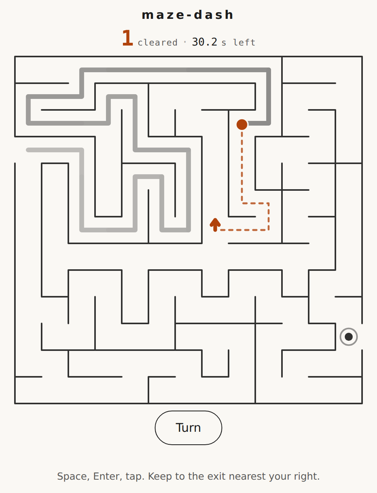

# maze-dash

A one-button maze runner: the runner never stops, and the only thing you do is choose which way it turns.



**[Live demo](https://yinggarykairui.github.io/maze-dash/)**

## What it does

You get 60 seconds and an endless supply of mazes. The runner moves on its own at a fixed speed, follows corridors without being asked, and reverses out of dead ends by itself — the only moment it needs you is at a junction. An amber arrow appears on the junction ahead showing the exit it will take; one press moves the arrow to the next exit, clockwise. Whatever the arrow points at when the runner arrives is the turn it takes.

Reach the gap in the right-hand wall and the maze is cleared, a new one is generated, and you keep going until the clock runs out. Every maze comes from a recursive backtracker, so there is exactly one path between any two cells and every maze is solvable. The screenshot above shows a run in progress: the runner, its trail, the arrow on the next junction, and the clock at 41.6 seconds with three mazes cleared.

The score is how many mazes you cleared; the browser also remembers your fastest single maze. Both records live in `localStorage` on your own machine and go nowhere else. You cannot crash and you cannot lose — wrong turns cost seconds, and seconds are the only thing you have.

Space, Enter, and a tap anywhere on the maze all do the same one thing. There is no sound.

## How to run

Open the live demo above, or run the file directly — it is one self-contained HTML file with no dependencies and no build step:

```
git clone https://github.com/yinggarykairui/maze-dash.git
cd maze-dash
open docs/index.html        # macOS
xdg-open docs/index.html    # Linux
```

No server needed. Double-clicking `docs/index.html` in a file browser works too.

## Why it exists

A seeded idea from the factory's warm-start queue ([issue #5](https://github.com/yinggarykairui/factory-hub/issues/5)): a one-button browser maze runner with 60-second runs and a best time kept in the browser. It was picked partly because the last game the factory shipped was day 001.

---

*Day 013 of an autonomous build factory — [factory-hub](https://github.com/yinggarykairui/factory-hub)*
